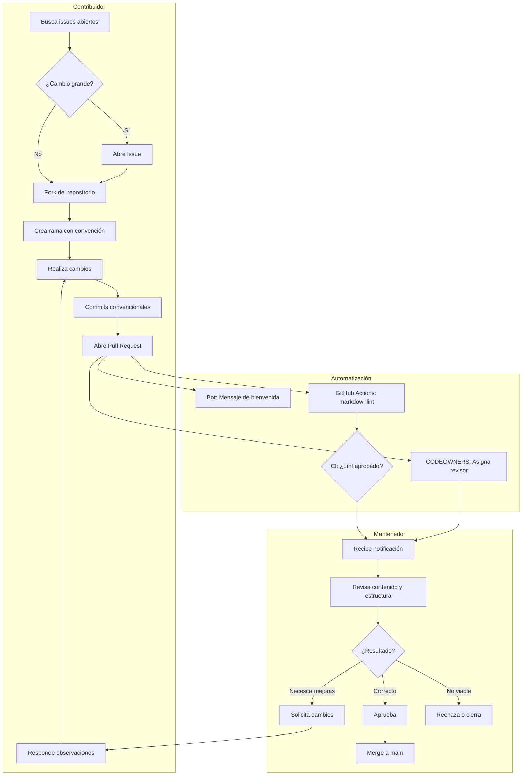

# Reglas para contribuir

Gracias por ayudar a mejorar las clases del Club de Programación Competitiva de
la UAEH. Este repositorio recibe material educativo, editoriales, correcciones
y propuestas de la comunidad. Lee también el [Código de Conducta](./CODE_OF_CONDUCT.md).

## Qué puedes aportar

- Correcciones de ortografía, redacción, enlaces o errores técnicos.
- Nuevas explicaciones, ejemplos y temas de programación competitiva.
- Editoriales de problemas con razonamiento, correctitud y complejidad.
- Problemas de práctica o propuestas para el roadmap.
- Revisión de issues y Pull Requests existentes.

No agregues soluciones copiadas sin atribución, contenido que no puedas verificar
o cambios que no estén relacionados con el propósito educativo del repositorio.

## Antes de comenzar

1. Busca [issues y Pull Requests abiertos](https://github.com/KaarLarax/CPC-UAEH-Clases/issues) para evitar duplicar trabajo.
2. Para cambios grandes, abre un issue y explica la propuesta antes de implementarla.
3. Revisa el [README principal](../readme.md) y las plantillas en `template/`.

## Flujo de trabajo

### Para mantenedores

1. Crea una rama desde `main` siguiendo la convención de nombrado.
2. Realiza cambios pequeños y relacionados con una sola propuesta.
3. Usa nombres de archivos y carpetas en minúsculas, con guiones.
4. Sigue la estructura de `template/periodo-academico/nivel/tema/`.
5. Actualiza los índices y enlaces cuando agregues material.
6. Haz push de la rama y abre una Pull Request usando la plantilla del repositorio.
7. Espera la revisión de otro mantenedor antes de hacer merge.

### Para contribuidores

1. Haz un fork del repositorio.
2. Crea una rama siguiendo la convención de nombrado.
3. Realiza cambios pequeños y relacionados con una sola propuesta.
4. Usa nombres de archivos y carpetas en minúsculas, con guiones.
5. Sigue la estructura de `template/periodo-academico/nivel/tema/`.
6. Actualiza los índices y enlaces cuando agregues material.
7. Abre una Pull Request usando la plantilla del repositorio.

## Nombrado de ramas

Usa el formato `prefijo/descripcion-corta` con guiones:

| Prefijo      | Uso                                                    | Ejemplo                        |
|--------------|--------------------------------------------------------|--------------------------------|
| `feature/`   | Nuevo tema, material de clase o sección                | `feature/prefix-sum-intermedios` |
| `editorial/` | Editorial de un problema específico                    | `editorial/gauss-suma`         |
| `fix/`       | Corrección de ortografía, enlaces, código o errores    | `fix/typo-complejidad`         |
| `docs/`      | Mejora de documentación sin contenido nuevo            | `docs/mejorar-readme`          |
| `chore/`     | Cambios en plantillas, configuración o mantenimiento   | `chore/actualizar-template`    |

Ejemplos válidos:

```text
feature/recursividad-avanzados
editorial/binary-search-problem
fix/enlace-roto-notas
docs/agregar-ejemplo-mergesort
chore/workflow-markdown-lint
```

## Reglas para el contenido

- Escribe en español claro, inclusivo y accesible.
- Explica la idea antes del código; una editorial no debe ser solo una solución.
- Incluye restricciones, correctitud, complejidad temporal y memoria.
- Usa `$...$` para variables y expresiones matemáticas.
- Usa bloques `text` para entradas y salidas, y `cpp` para C++.
- Declara la autoría del material nuevo y atribuye fuentes externas.
- Verifica los enlaces y prueba los ejemplos antes de abrir la Pull Request.

## Commits

Usa mensajes breves en formato convencional en español:

```text
docs: agregar introducción a árboles
docs: mejorar explicación de búsqueda binaria
fix: corregir enlace de grafos
feat: agregar ejercicios de programación dinámica
chore: actualizar plantilla
refactor: reorganizar estructura de carpetas
```

| Tipo       | Uso                                                       |
|------------|-----------------------------------------------------------|
| `docs:`    | Documentación y explicaciones                             |
| `fix:`     | Correcciones de errores, enlaces o redacción              |
| `feat:`    | Nuevo contenido, temas o material de clase                |
| `chore:`   | Mantenimiento, plantillas o configuración                 |
| `refactor:`| Reorganización de archivos o estructura                   |

## Pull Requests

- Describe qué cambiaste y por qué.
- Enlaza el issue relacionado, si existe.
- Indica cómo verificaste el cambio.
- Responde a las observaciones de revisión con respeto.
- Habilita las ediciones de mantenedores si GitHub lo permite.

Las personas mantenedoras pueden solicitar cambios, cerrar propuestas duplicadas
o rechazar contenido que no cumpla estas reglas o el Código de Conducta. La
revisión busca mejorar el material, no descalificar a quien contribuye.

## Revisión y merge

Cuando recibas una Pull Request para revisar:

1. **Verifica el CI**: confirma que markdownlint pasó sin errores.
2. **Revisa la estructura**: confirma que los archivos siguen la convención de carpetas y nombrado.
3. **Revisa el contenido**: verifica claridad técnica, correctitud de ejemplos y complejidad.
4. **Verifica enlaces**: confirma que todos los enlaces funcionan.
5. **Solicita cambios** si algo necesita ajustes, o **aprueba** si todo está correcto.
6. **Haz merge a main** usando "Squash and merge" para mantener un historial limpio.

Si la Pull Request tiene conflictos de merge, solicita al autor que resuelva los conflictos antes de aprobar.

## Diagrama del flujo de revisión

El siguiente diagrama muestra el proceso completo desde que se abre una Pull
Request hasta que se integra al repositorio:



**Resumen del flujo:**

1. **Contribuidor** prepara cambios siguiendo las convenciones y abre la PR
2. **GitHub automáticamente** envía bienvenida, asigna revisor y ejecuta linting
3. **Mantenedor** revisa estructura, contenido, calidad técnica y resultado del CI
4. **Decisión**: solicitar cambios, aprobar y hacer merge, o rechazar
