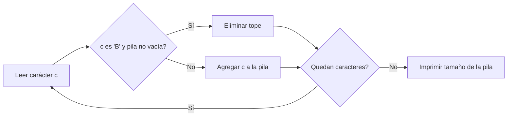

# ABBB

**Autor:** Tourist

**Link:** [https://cpcjudge.com/problem/abbb](https://cpcjudge.com/problem/abbb)

## Descripción

Suzie Kepere está en medio de un juego. En este juego, ella debe usar bombas para bombardear una cadena compuesta por las letras "A" y "B". Puede usar bombas para bombardear una subcadena que sea "AB" o "BB". Al bombardear una subcadena de este tipo, esta se elimina de la cadena y las partes restantes se concatenan.

Por ejemplo, Suzie puede usar dos operaciones como: **AABABBA** $\rightarrow$ **AABBA** $\rightarrow$ **AAA**.

Suzie Kepere se pregunta cuál es la cadena más corta que puede formar. ¿Puedes ayudarle a encontrar la longitud de la cadena más corta?

## Entrada

Cada prueba contiene múltiples casos de prueba. La primera línea contiene un entero $t$ ($1 \le t \le 20000$) — el número de casos de prueba. A continuación, se describe cada caso de prueba.

Cada una de las siguientes $t$ líneas contiene un caso de prueba, que consiste en una cadena no vacía $s$ — la cadena que Suzie necesita bombardear. Se garantiza que todos los símbolos de $s$ sean 'A' o 'B'.

Se garantiza que la suma de $|s|$ (longitud de $s$) entre todos los casos de prueba no exceda $2 \cdot 10^5$.

## Salida

Para cada caso de prueba, imprime un solo entero: la longitud de la cadena más corta que Suzie puede crear.

## Ejemplos

### Ejemplo de entrada

```text
3
AAA
BABA
AABBBABBBB
```

### Ejemplo de salida

```text
3
2
0
```

### Nota

Para el primer caso de prueba, no se pueden realizar movimientos, por lo que la respuesta es 3. Para el segundo caso de prueba, una secuencia óptima de movimientos es **BABA** $\rightarrow$ **BA**. Por lo tanto, la respuesta es 2. Para el tercer caso de prueba, una secuencia óptima de movimientos es **AABBBABBBB** $\rightarrow$ **AABBBABB** $\rightarrow$ **AABBBB** $\rightarrow$ **ABBB** $\rightarrow$ **AB** $\rightarrow$ (cadena vacía). Por lo tanto, la respuesta es 0.

## Temas identificados

### Programación

- Análisis de complejidad.
- Procesamiento de múltiples consultas.
- Uso de pilas (stacks) o simulación.

## Propuesta de solución

**Autor de la propuesta:** Kaarlarax

El problema pide encontrar la longitud mínima de una cadena después de eliminar
repetidamente las subcadenas "AB" y "BB".

La clave está en observar que ambas subcadenas eliminables ("AB" y "BB") terminan
en 'B' y tienen longitud 2. Esto significa que cada 'B' puede eliminar al carácter
inmediatamente anterior (sin importar si es 'A' o 'B'), siempre que exista uno.

El enfoque óptimo es usar una pila:

1. Recorrer la cadena de izquierda a derecha.
2. Si el carácter actual es 'A', se agrega a la pila.
3. Si el carácter actual es 'B':
   - Si la pila no está vacía, se elimina el tope (el 'B' elimina al carácter anterior).
   - Si la pila está vacía, se agrega el 'B' a la pila.
4. La respuesta es el tamaño final de la pila.

## Observaciones

- Las subcadenas eliminables son "AB" y "BB". Ambas terminan en 'B'.
- Un 'B' siempre puede eliminar al carácter inmediatamente anterior si existe.
- Un 'A' nunca puede eliminar a otro carácter directamente.
- El orden de eliminación no afecta la longitud final mínima (propiedad de confluencia).

## Restricciones

La suma de $|s|$ entre todos los casos de prueba no excede $2 \cdot 10^5$.
El enfoque con pila procesa cada carácter una sola vez, lo que da una
complejidad lineal por caso de prueba y es suficiente para los límites dados.

## Estados o estructura de la solución

Se utiliza una pila (implementada como una cadena o `vector<char>`) que
representa los caracteres que no han sido eliminados:

- `s` (pila): almacena los caracteres que permanecen en la cadena.
- Para cada carácter de la entrada, se decide si se agrega o si elimina al tope.

## Casos base

- Cadena "AAA": ninguna subcadena "AB" o "BB" está presente, la respuesta es 3.
- Cadena "AB": se elimina directamente, la respuesta es 0.
- Cadena "BB": se elimina directamente, la respuesta es 0.

## Transiciones o algoritmo

1. Leer $t$ (número de casos de prueba).
2. Para cada caso de prueba:
   - Inicializar una pila vacía.
   - Recorrer cada carácter $c$ de la cadena:
     - Si $c = $ 'A', agregar $c$ a la pila.
     - Si $c = $ 'B' y la pila no está vacía, eliminar el tope.
     - Si $c = $ 'B' y la pila está vacía, agregar $c$ a la pila.
   - Imprimir el tamaño de la pila.



## Correctitud

El algoritmo es correcto porque:

- Cada 'B' puede emparejarse con el carácter inmediatamente anterior (sea 'A' o
  'B'), eliminando ambos. La pila modela esta operación directamente.
- Los caracteres 'A' que permanecen en la pila no pueden ser eliminados porque
  no existe ningún carácter posterior que los elimine (las subcadenas "AA" y "BA"
  no son eliminables).
- Los caracteres 'B' que permanecen en la pila (al inicio, sin carácter anterior)
  no pueden ser eliminados porque no hay un carácter previo con el cual
  emparejarlos.

El resultado es la longitud mínima posible.

## Complejidad computacional

- Tiempo por caso: $O(|s|)$.
- Tiempo total: $O\left(\sum |s|\right) = O(2 \cdot 10^5) = O(N)$.
- Memoria: $O(|s|)$ para la pila.

## Implementación

### C++

**Autor de la implementación:** KaarLarax

```cpp
#include <bits/stdc++.h>

using namespace std;

#define edl '\n'

void solve() {
    string s;
    char aux;
    while (cin.get(aux)) {
        if (aux == '\n') {
            break;
        }
        if (aux == 'B' && !s.empty()) {
            s.pop_back();
        } else {
            s += aux;
        }
    }
    cout << sz(s) << edl;
}

int main() {
    ios_base::sync_with_stdio(false), cin.tie(nullptr);
    int q = 1;
    cin >> q;
    cin.ignore();
    while (q--) {
        solve();
    }
    return 0;
}
// By KaarLarax
```

## Casos límite

- Cadena de solo 'A's: no se puede eliminar nada, la respuesta es $|s|$.
- Cadena de solo 'B's de longitud par: todos se eliminan por pares, la respuesta es 0.
- Cadena de solo 'B's de longitud impar: queda un 'B', la respuesta es 1.
