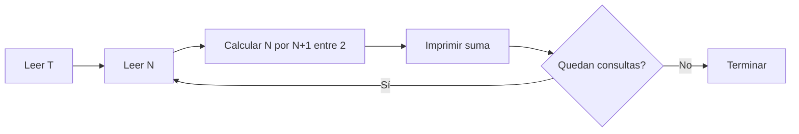

# Gauss, el pequeño matemático del bosque

#### Autor: KaarLarax

## Descripción

Gauss, el pequeño matemático del bosque, quiere calcular rápidamente la suma de
todos los números desde $1$ hasta $N$. Los animalitos del bosque le darán
diferentes valores de $N$ en una serie de consultas, y él desea conocer el
resultado de la sumatoria:

$$S = 1 + 2 + 3 + \dots + N$$

Tu tarea es ayudar a Gauss generando la respuesta correcta para cada valor de
$N$.

## Entrada

La entrada contiene un entero $T$ ($1 \leq T \leq 100$) que representa la
cantidad de casos de prueba.

Le siguen $T$ líneas, cada una con un único entero $N$
($1 \leq N \leq 10^9$), que representa el límite superior de la sumatoria.

## Salida

Imprime $T$ líneas. En cada línea debe aparecer un único entero: la sumatoria
desde $1$ hasta el valor de $N$ correspondiente.

## Ejemplos

### Entrada

```text
3
10
1
100
```

### Salida

```text
55
1
5050
```

## Temas identificados

### Programación

- Análisis de complejidad.
- Procesamiento de múltiples consultas.
- Uso de enteros de 64 bits.

### Matemáticas

- Sumatoria de una progresión aritmética.
- Fórmula de Gauss.

## Propuesta de solución

#### Autor: KaarLarax

El enfoque directo consiste en recorrer todos los números desde $1$ hasta $N$ y
acumularlos. Sin embargo, ese enfoque tarda $O(N)$ por consulta y puede ser
demasiado lento cuando $N$ es grande.

La suma de los primeros $N$ enteros se obtiene con la fórmula:

$$S = \frac{N(N + 1)}{2}$$

Esta expresión permite responder cada consulta con una cantidad constante de
operaciones, sin importar el valor de $N$.

## Observaciones

- Los números pueden agruparse por parejas: $1 + N$, $2 + (N - 1)$, etc.
- Cada pareja suma $N + 1$.
- La fórmula funciona tanto para valores pares como impares de $N$ porque uno
  de los factores $N$ y $N + 1$ siempre es par.

### ¿Qué ocurre cuando $N$ es impar?

Si $N$ es impar, entonces $N + 1$ es par. Por eso la división entre $2$ puede
aplicarse al segundo factor antes de multiplicar:

$$S = \frac{N(N + 1)}{2} = N\left(\frac{N + 1}{2}\right)$$

Por ejemplo, para $N = 5$:

$$S = \frac{5(5 + 1)}{2} = 5\left(\frac{6}{2}\right) = 5 \cdot 3 = 15$$

La suma correspondiente es $1 + 2 + 3 + 4 + 5 = 15$.

Si $N$ es par, la división se aplica al primer factor en lugar del segundo:

$$S = \frac{N}{2}(N + 1)$$

Por ejemplo, para $N = 6$:

$$S = \frac{6}{2}(6 + 1) = 3 \cdot 7 = 21$$

En C++, la expresión `n * (n + 1) / 2` también es correcta porque la
multiplicación $N(N + 1)$ siempre es par. La división se realiza sobre un
resultado exacto, nunca sobre una fracción truncada.

## Restricciones

Un ciclo hasta $N$ podría ejecutar hasta $10^9$ iteraciones en una sola
consulta. Como $T$ puede ser igual a $100$, ese enfoque sería demasiado lento.

La fórmula permite responder cada consulta en tiempo constante. Además, como el
resultado máximo es cercano a $5 \times 10^{17}$, se debe usar `long long` en
lugar de `int`.

## Estados o estructura de la solución

No se necesitan estados ni estructuras de datos adicionales. Para cada consulta
se utilizan las variables:

- `n`: el límite superior de la sumatoria.
- `s`: el resultado de $n(n + 1) / 2$.

## Casos base

Para $N = 1$, la fórmula produce:

$$\frac{1(1 + 1)}{2} = 1$$

que coincide con la suma esperada.

## Transiciones o algoritmo

1. Leer $T$.
2. Repetir $T$ veces:
   - Leer $N$.
   - Calcular $N(N + 1) / 2$.
   - Imprimir el resultado.



## Correctitud

Para cada consulta, la fórmula de Gauss establece que la suma de los enteros
desde $1$ hasta $N$ es $N(N + 1) / 2$. El algoritmo calcula exactamente esa
expresión y la imprime.

Como el algoritmo repite este procedimiento una vez por cada consulta, produce
una respuesta correcta para cada valor de $N$ y conserva el orden de entrada.

## Complejidad computacional

- Tiempo por consulta: $O(1)$.
- Tiempo total: $O(T)$.
- Memoria: $O(1)$.

## Implementación

### C++

#### Autor: KaarLarax

```cpp
#include <bits/stdc++.h>
using namespace std;

using ll = long long;

void solve() {
    ios_base::sync_with_stdio(false);
    cin.tie(NULL);

    ll t;
    cin >> t;

    while (t--) {
        ll n;
        cin >> n;

        ll s = n * (n + 1) / 2;
        cout << s << "\n";
    }
}

int main() {
    solve();
    return 0;
}
```

## Casos límite

- $N = 1$: la respuesta es $1$.
- $N = 10^9$: la respuesta es $500000000500000000$ y requiere 64 bits.
- $T = 100$: se procesa cada consulta de manera independiente en tiempo
  constante.
