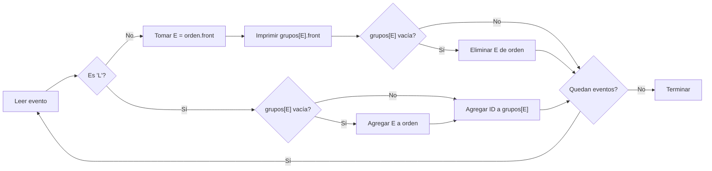

# La fila de la posada de Don Liborio

**Autor:** KaarLarax

**Link:** https://cpcjudge.com/problem/liboriotamales

## Descripción

Se acerca la Navidad y en el pueblo ya comenzaron las tradicionales posadas. Como cada año, don Liborio reparte los tamales a los niños que hacen fila frente a su casa.

Sin embargo, los niños son muy listos:
cuando un niño llega a la fila y ya hay otro niño de su **MISMA ESCUELA**, no se forma hasta el final, sino que se mete justo **DETRÁS DEL ÚLTIMO NIÑO DE SU MISMA ESCUELA** que ya esté en la fila.
Pero si no hay ningún niño de su escuela en la fila, entonces sí se forma hasta el final como corresponde.

Cada niño:

- Tiene un identificador único $(ID)$.
- Pertenece a una sola $\text{ESCUELA}$.
- Nunca entra dos veces sin haber recibido antes sus tamales.

Ya que don Liborio es tu abuelo y tú como eres programador competitivo quieres ayudarlo para solucionar esa situación, considerando la llegada de los niños y la entrega de los tamales.


## Entrada

Primero se te dará un número entero $N$  $(1 \leq N \leq 2 \cdot 10^5)$ — el número de eventos que ocurren durante la posada.

Las siguientes $N$ líneas describen cada evento:

- $L$, $ID$ y $E$ — Un niño con número de identificación $ID$ y que pertenece a la escuela $E$ llega a la fila para recibir sus tamales.
- $R$ — Don Liborio entrega los tamales al niño que está hasta enfrente de la fila, y ese niño se retira.

Se garantiza que:

- Siempre que ocurra un evento $R$, hay al menos un niño en la fila.
- Cada $ID$ es único.

Los valores de $ID$ pueden ser grandes $1 \leq ID \leq 10^9$.

Los valores de la $\text{ESCUELA}$ satisfacen: $1 \leq E \leq 10^9$.

## Salida

Por cada evento $R$, imprime en una línea el identificador $(ID)$ del niño que recibió sus tamales.

## Ejemplos

### Ejemplo de entrada

```text
8
L 101 1
L 201 2
L 102 1
R
L 301 3
R
R
R
```

### Ejemplo de salida

```text
101
102
201
301
```

## Temas identificados

### Programación

- Colas (queues).
- Mapas (map / diccionarios).
- Procesamiento de eventos en línea.

## Propuesta de solución

**Autor de la propuesta:** KaarLarax

El problema modela una fila con inserciones intermedias: cuando un niño llega y ya hay alguien de su misma escuela en la fila, se coloca justo detrás del último niño de esa escuela. Si no hay nadie de su escuela, se forma al final.

La clave es notar que los niños de una misma escuela siempre forman un bloque contiguo en la fila, y que las escuelas se atienden en el orden en que aparecieron por primera vez. Esto permite modelar la fila con dos estructuras:

1. Una **cola de escuelas** (`orden`): almacena las escuelas en el orden en que llegaron a la fila. Solo se agrega una escuela cuando llega el primer niño de esa escuela (o cuando la escuela ya no tenía a nadie en la fila).

2. Un **mapa de escuela a cola de IDs** (`grupos`): para cada escuela, almacena los IDs de sus niños en orden de llegada.

Con esto, atender un evento $R$ consiste en tomar el primer ID de la cola de la primera escuela, y si esa cola queda vacía, eliminar la escuela de `orden`.

## Observaciones

- Los niños de una misma escuela siempre forman un grupo contiguo en la fila.
- El orden en que se atienden las escuelas es el orden de su primera aparición en la fila (FIFO entre escuelas).
- Dentro de cada escuela, los niños se atienden en orden de llegada (FIFO).
- No es necesario simular la fila completa ni insertar en posiciones intermedias.

## Restricciones

$N$ puede ser hasta $2 \cdot 10^5$. Las operaciones de `map` toman $O(\log K)$ donde $K$ es el número de escuelas distintas, lo que da una complejidad total de $O(N \log N)$. Esto es suficiente para los límites del problema.

## Estados o estructura de la solución

Se utilizan dos estructuras de datos:

- `orden` (`queue<int>`): cola de escuelas en el orden en que deben ser atendidas.
- `grupos` (`map<int, queue<int>>`): para cada escuela, la cola de IDs de niños que esperan en la fila.

## Casos base

- Un solo niño llega y se atiende: se agrega a `orden` y `grupos`, y al atender $R$ se imprime su ID y se limpia todo.
- Dos niños de la misma escuela llegan consecutivamente: ambos van a la misma cola en `grupos`, la escuela aparece una sola vez en `orden`.

## Transiciones o algoritmo

1. Leer $N$.
2. Para cada evento:
   - Si es $L$, $ID$, $E$:
     - Si `grupos[E]` está vacía, agregar $E$ al final de `orden`.
     - Agregar $ID$ al final de `grupos[E]`.
   - Si es $R$:
     - Tomar $E$ del frente de `orden`.
     - Tomar $ID$ del frente de `grupos[E]` e imprimirlo.
     - Eliminar $ID$ de `grupos[E]`.
     - Si `grupos[E]` queda vacía, eliminar $E$ de `orden`.



## Correctitud

El algoritmo es correcto porque:

- La cola `orden` respeta el orden FIFO entre escuelas: la primera escuela en llegar a la fila es la primera en ser atendida.
- Dentro de cada escuela, la cola `grupos[E]` respeta el orden de llegada de los niños, que es exactamente el orden en que se insertaron detrás del último niño de su escuela.
- Cuando un evento $R$ ocurre, el niño al frente de la fila es el primer niño de la primera escuela en `orden`, lo cual coincide con la descripción del problema.
- Cuando una escuela se queda sin niños, se elimina de `orden` para que no vuelva a ser considerada hasta que llegue otro niño de esa escuela.

## Complejidad computacional

- Tiempo por evento: $O(\log N)$ por las operaciones de `map`.
- Tiempo total: $O(N \log N)$.
- Memoria: $O(N)$ para almacenar los niños en la fila.

## Implementación

### C++

**Autor de la implementación:** KaarLarax

```cpp
#include <bits/stdc++.h>

using namespace std;

int main() {
    ios::sync_with_stdio(false);
    cin.tie(nullptr);

    int n;
    cin >> n;

    queue<int> orden;                 // cola de prioridades e
    map<int, queue<int>> grupos;      // e -> cola de ids

    while (n--) {
        char op;
        cin >> op;

        if (op == 'L') {
            int id, e;
            cin >> id >> e;

            if (grupos[e].empty()) {
                orden.push(e);
            }
            grupos[e].push(id);

        } else { // 'R'
            int e = orden.front();
            int id = grupos[e].front();
            cout << id << '\n';

            grupos[e].pop();
            if (grupos[e].empty()) {
                orden.pop();
            }
        }
    }

    return 0;
}
```

## Casos límite

- Todos los niños son de la misma escuela: se atienden en orden de llegada, uno por uno.
- Todos los niños son de escuelas distintas: cada escuela aparece una sola vez en `orden`, se atienden en orden de llegada.
- $N = 2 \cdot 10^5$: se procesan todos los eventos en $O(N \log N)$, dentro del límite de tiempo.
