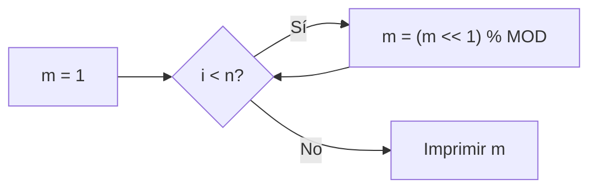

# Cadenas de Bits

**Autor:** CSES Problem Set

**Link:** [https://cses.fi/problemset/task/1617/](https://cses.fi/problemset/task/1617/)

## Descripción

Tu tarea es calcular el número de cadenas de bits de longitud $n$.

Una cadena de bits es una secuencia de $0$'s y $1$'s. Por ejemplo, si $n = 3$, las cadenas de bits posibles son: $000$, $001$, $010$, $011$, $100$, $101$, $110$ y $111$, por lo que la respuesta es $8$.

### Problema

Dado un entero $n$, calcula el número total de cadenas de bits distintas de longitud $n$, módulo $10^9 + 7$.

## Entrada

- La única línea de entrada contiene un entero $n$.

## Salida

- Imprime el resultado módulo $10^9 + 7$.

## Ejemplos

### Ejemplo de entrada

```text
3
```

### Ejemplo de salida

```text
8
```

## Notas

Para $n = 3$, existen $2^3 = 8$ cadenas de bits posibles: $000$, $001$, $010$, $011$, $100$, $101$, $110$, $111$.

## Temas identificados

### Programación

- Desplazamiento de bits (`<<`)
- Operaciones modulares

### Matemáticas

- Potencias de $2$
- Aritmética modular

## Propuesta de solución

**Autor de la propuesta:** KaarLarax

Cada posición en una cadena de bits de longitud $n$ puede tomar uno de dos valores: $0$ o $1$. Dado que hay $n$ posiciones independientes, el número total de cadenas de bits distintas es:

$$2 \times 2 \times 2 \times \cdots \times 2 = 2^n$$

El resultado debe calcularse módulo $10^9 + 7$. Podemos calcular $2^n \pmod{10^9 + 7}$ de forma iterativa, multiplicando por $2$ en cada paso (equivalente a un desplazamiento a la izquierda de bits, `<< 1`) y aplicando el módulo para evitar desbordamientos.

## Observaciones

- El operador `<<` (desplazamiento a la izquierda) es equivalente a multiplicar por $2$. Usar `m << 1` en lugar de `m * 2` es una práctica común en programación competitiva cuando trabajamos con potencias de $2$.
- Es fundamental aplicar el módulo después de cada multiplicación para evitar desbordamientos de entero. Con $n$ hasta $10^6$, calcular $2^n$ sin módulo es imposible de almacenar en tipos estándar.

## Restricciones

- $1 \leq n \leq 10^6$: requiere un algoritmo de a lo más $O(n)$ en tiempo. El enfoque iterativo con un ciclo de $n$ iteraciones cumple con esta restricción cómodamente.
- Límite de tiempo de $1.00$ segundo y memoria de $512$ MB: más que suficientes para este enfoque.

## Estados o estructura de la solución

- `n`: entero que almacena la longitud de la cadena de bits.
- `m`: entero que acumula el resultado parcial de $2^i \pmod{10^9 + 7}$ después de la iteración $i$-ésima.

## Casos base

- $n = 1$: la respuesta es $2^1 = 2$ (las cadenas son `0` y `1`).

## Transiciones o algoritmo

1. Inicializar `m = 1` (que representa $2^0 = 1$).
2. Para cada iteración $i$ de $0$ a $n - 1$:
   - Desplazar `m` una posición a la izquierda: `m << 1` (equivalente a multiplicar por $2$).
   - Aplicar módulo: `m = (m << 1) % MOD`.
3. Imprimir `m`, que contiene $2^n \pmod{10^9 + 7}$.



## Correctitud

En cada iteración $i$, la variable `m` contiene el valor $2^{i+1} \pmod{10^9 + 7}$. Después de $n$ iteraciones, `m` contiene $2^n \pmod{10^9 + 7}$, que es exactamente el número de cadenas de bits de longitud $n$ módulo $10^9 + 7$. La aplicación del módulo en cada paso garantiza que el resultado intermedio nunca desborda un entero de $32$ bits, ya que $2 \times (10^9 + 6) = 2 \times 10^9 + 12 < 2^{31} - 1 \approx 2.14 \times 10^9$.

## Complejidad computacional

- Tiempo: $O(n)$, ya que realizamos $n$ iteraciones con operaciones $O(1)$ en cada una.
- Memoria: $O(1)$, solo utilizamos variables enteras.

## Implementación

### C++

**Autor de la implementación:** KaarLarax

```cpp
#include <bits/stdc++.h>
using namespace std;

constexpr unsigned int MOD = 1e9 + 7;

int32_t main() {
    ios_base::sync_with_stdio(false), cin.tie(nullptr);
    unsigned int n, m = 1;
    cin >> n;
    for (int i = 0; i < n; ++i) {
        m = (m << 1) % MOD;
    }
    cout << m << endl;
    return 0;
}
```

## Casos límite

- $n = 1$: la respuesta es $2$ (cadenas `0` y `1`).
- $n = 10^6$: valor máximo permitido. El resultado es $2^{10^6} \pmod{10^9 + 7}$, calculado sin desbordamiento gracias al módulo aplicado en cada iteración.
- $n$ tal que $2^n < 10^9 + 7$: el módulo no afecta el resultado y se obtiene $2^n$ directamente.
