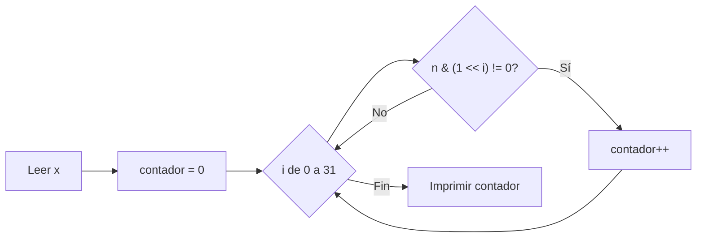

# A. Crianza de Bacterias

**Autor:** Codeforces Round 320 (Div. 2)

**Link:** [https://codeforces.com/problemset/problem/579/A](https://codeforces.com/problemset/problem/579/A)

## Descripción

Eres un amante de las bacterias y quieres criar algunas en una caja.

Inicialmente, la caja está vacía. Cada mañana, puedes introducir cualquier cantidad de bacterias en la caja. Cada noche, cada bacteria en la caja se divide en dos bacterias. Esperas ver exactamente $x$ bacterias en la caja en algún momento.

¿Cuál es el número mínimo de bacterias que necesitas introducir en la caja a lo largo de todos los días?

## Entrada

- Una única línea con un entero $x$ ($1 \leq x \leq 10^9$).

## Salida

- Una única línea con un entero: la respuesta.

## Ejemplos

### Ejemplo de entrada

```text
5
```

### Ejemplo de salida

```text
2
```

### Ejemplo de entrada 2

```text
8
```

### Ejemplo de salida 2

```text
1
```

## Notas

Para el primer ejemplo, podemos introducir una bacteria en la caja la primera mañana; en la tercera mañana habrá $4$ bacterias en la caja. Luego introducimos una más, resultando en $5$ bacterias. Introdujimos $2$ bacterias en total, por lo que la respuesta es $2$.

Para el segundo ejemplo, podemos introducir una bacteria la primera mañana y en la cuarta mañana habrá $8$ bacterias en la caja. La respuesta es $1$.

## Temas identificados

### Programación

- Operadores bitwise (`&`, `<<`)
- Conteo de bits encendidos (popcount)

### Matemáticas

- Representación binaria de números enteros
- Potencias de $2$

## Propuesta de solución

**Autor de la propuesta:** KaarLarax

La clave para resolver este problema radica en entender cómo crecen las bacterias. Cada bacteria que introducimos en la mañana del día $k$ se duplica cada noche, por lo que al pasar $d - k$ noches, esa bacteria original habrá producido $2^{d-k}$ bacterias.

Esto significa que cualquier cantidad $x$ de bacterias que deseamos obtener puede expresarse como una suma de potencias de $2$, donde cada potencia corresponde a una bacteria introducida en un día específico. Por ejemplo, $x = 5 = 4 + 1 = 2^2 + 2^0$, lo que significa que necesitamos una bacteria introducida con $2$ noches de anticipación y otra bacteria introducida sin noches de anticipación.

El número mínimo de bacterias que necesitamos introducir es igual al número de bits encendidos ($1$'s) en la representación binaria de $x$.

## Observaciones

- Cada bacteria introducida en un día diferente contribuye exactamente una potencia de $2$ distinta al total. Esto es equivalente a decir que cada bit encendido en la representación binaria de $x$ requiere exactamente una bacteria.
- No tiene sentido introducir más de una bacteria el mismo día si podemos introducirlas en días diferentes, ya que una bacteria introducida el día $k$ se convierte en $2^m$ bacterias después de $m$ noches, y nunca podemos "combinar" bacterias para reducir el total.
- El problema se reduce simplemente a contar cuántos bits están encendidos en $x$.

## Restricciones

- $1 \leq x \leq 10^9$, lo que cabe en un entero sin signo de $32$ bits ($2^{32} > 4 \times 10^9$). Basta con iterar sobre los $32$ bits del entero.
- Límite de tiempo de $1$ segundo, más que suficiente para un recorrido de $32$ iteraciones.

## Estados o estructura de la solución

- `n`: entero sin signo que almacena el valor de entrada $x$.
- `contador`: entero que acumula el número de bits encendidos encontrados.
- `i`: índice del bit actual que se está comprobando (de $0$ a $31$).

## Casos base

- $x = 1$: la respuesta es $1$ (un solo bit encendido, $1 = 2^0$).
- $x$ es potencia de $2$: la respuesta es $1$ (solo un bit encendido).

## Transiciones o algoritmo

1. Leer el entero $x$.
2. Inicializar `contador = 0`.
3. Para cada bit $i$ desde $0$ hasta $31$:
   - Comprobar si el bit $i$-ésimo está encendido usando `n & (1 << i)`.
   - Si está encendido, incrementar `contador`.
4. Imprimir `contador`.



## Correctitud

Cada bacteria que introducimos contribuye exactamente una potencia de $2$ al total de bacterias en algún momento futuro. Dado que la representación binaria de cualquier entero positivo es única, la cantidad mínima de potencias de $2$ distintas que suman $x$ es exactamente el número de bits encendidos en su representación binaria. El algoritmo cuenta cada bit encendido una y solo una vez, garantizando la respuesta correcta.

## Complejidad computacional

- Tiempo: $O(32) = O(1)$, ya que siempre se iteran exactamente $32$ bits.
- Memoria: $O(1)$, solo se utilizan variables enteras.

## Implementación

### C++

**Autor de la implementación:** KaarLarax

```cpp
#include <bits/stdc++.h>
using namespace std;

int32_t main() {
    ios_base::sync_with_stdio(false), cin.tie(nullptr);
    unsigned int n, contador = 0;
    cin >> n;
    for (int i = 0; i < 32; ++i) {
        if (n & (1 << i)) {
            contador++;
        }
    }
    cout << contador << endl;
    return 0;
}
```

## Casos límite

- $x = 1$: un solo bit encendido, la respuesta es $1$.
- $x = 10^9$: valor máximo permitido, cabe sin problemas en un `unsigned int` de $32$ bits.
- $x = 2^{30} = 1073741824$: potencia de $2$ con un solo bit encendido, la respuesta es $1$.
- $x = 2^{30} - 1 = 1073741823$: $30$ bits encendidos, la respuesta es $30$.
