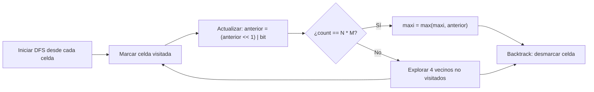

# J. Inspirado en Tailandia

**Autor:** Tourist, Christopher_Rdz, contla_cpp

**Link:** [https://cpcjudge.com/problem/xpocetabril2025j](https://cpcjudge.com/problem/xpocetabril2025j)

## Descripción

Uno de los paises que más te gusta es Tailandia y sus templos hermosos que hay, quisieras ir de paseo y presenciar las hermosas vistas que este país ofrece, lamentablemente no tienes dinero y necesitas empezar a trabajar de programador para empezar a guardar y así un día visitar todo el mundo. En tu estudio para preparte para los problemas que te pudieran poner en las entrevistas de las empresas, te encontraste con uno que llamó bastante tu atención.

Se te da una matriz de $N$ filas por $M$ columnas, en donde cada casilla contiene un `1` o un `0`. Tu tarea es encontrar una ruta válida tal que, al escribir los valores de cada casilla que hay en la ruta, formes el valor binario más grande posible y lo conviertas a su base decimal. Una ruta válida es aquella en donde puedes empezar y terminar en cualquier casilla de la matriz, de tal forma que visites todas y cada una de las casillas que tiene la matriz, pero solo puedes pasar una vez por cada casilla. Si estás en una casilla, solo puedes irte a sus casillas adyacentes (arriba, abajo, izquierda y derecha).

### Problema

Dado la matriz binaria de $N$ x $M$, encuentra la mejor ruta válida tal que el valor expresado en decimal de esa ruta sea el máximo.

## Entrada

- En la primera línea habrá dos números: $N$ y $M$, el tamaño de la matriz.
- En las siguientes $N$ líneas habrá $M$ números, correspondientes a la matriz.

## Salida

Un número que representa el máximo valor convertido a decimal de la mejor ruta válida posible.

## Ejemplos

### Ejemplo de entrada

```text
2 2
1 0
1 1
```

### Ejemplo de salida

```text
14
```

### Ejemplo de entrada 2

```text
3 3
1 0 0
1 1 0
0 1 0
```

### Ejemplo de salida 2

```text
450
```

## Notas

Para el primer ejemplo, una de las rutas óptimas es $(1,1) \rightarrow (2,1) \rightarrow (2,2) \rightarrow (1,2)$, que produce el binario $1110 = 14$ en decimal.

Para el segundo ejemplo, una ruta óptima es $(2,2) \rightarrow (2,1) \rightarrow (1,1) \rightarrow (1,2) \rightarrow (1,3) \rightarrow (2,3) \rightarrow (3,3) \rightarrow (3,2) \rightarrow (3,1)$, que produce $111000010 = 450$ en decimal.

## Temas identificados

### Programación

- DFS con backtracking
- Operadores bitwise (`<<`, `|`)

### Matemáticas

- Conversión binario a decimal

## Propuesta de solución

**Autor de la propuesta:** KaarLarax

El problema pide encontrar un camino Hamiltoniano en una grilla que maximice el valor decimal del número binario formado por los bits visitados. Dado que las restricciones son muy pequeñas ($N, M \leq 5$, es decir, máximo $25$ casillas), un enfoque de fuerza bruta con DFS y backtracking es viable.

La idea es probar todas las rutas posibles comenzando desde cada casilla de la matriz. En cada paso del DFS, construimos el número binario acumulado usando operadores bitwise:

```cpp
anterior = (anterior << 1) | matrix[n][m];
```

Esto equivale a desplazar todos los bits existentes una posición a la izquierda (multiplicar por $2$) y luego encender el bit menos significativo si la casilla actual contiene un $1$. Es exactamente la forma de construir un número binario dígito a dígito, pero de manera eficiente usando operaciones a nivel de bits.

## Observaciones

- El valor binario se construye de izquierda a derecha conforme avanzamos en la ruta, por lo que los bits visitados primero ocupan las posiciones más significativas. Maximizar el valor decimal equivale a priorizar que los bits más significativos sean $1$.
- Con $N, M \leq 5$, el número máximo de casillas es $25$. Aunque en el peor caso el número de caminos Hamiltonianos es factorial, la estructura de grilla limita enormemente las opciones en cada paso (máximo $4$ vecinos), haciendo que el backtracking sea factible en tiempo.
- No se necesita poda (pruning) adicional porque las restricciones son lo suficientemente pequeñas.

## Restricciones

- $1 \leq N, M \leq 5$ implica un máximo de $25$ casillas. El espacio de búsqueda es manejable con DFS + backtracking.
- La matriz solo contiene $0$'s y $1$'s, lo que simplifica la construcción del número binario.
- Límite de tiempo de $2.0$ segundos, suficiente para explorar todas las rutas posibles en una grilla de $5 \times 5$.

## Estados o estructura de la solución

- `visited[i][j]`: matriz booleana que indica si la casilla $(i, j)$ ya fue visitada en la ruta actual.
- `anterior`: entero que almacena el valor binario acumulado conforme se recorre la ruta.
- `count`: número de casillas visitadas hasta el momento.
- `maxi`: variable global que almacena el máximo valor decimal encontrado.

## Casos base

- Cuando `count == N * M` (se visitaron todas las casillas), se actualiza `maxi = max(maxi, anterior)` y se retorna.

## Transiciones o algoritmo

1. Para cada casilla $(i, j)$ de la matriz, iniciar un DFS con `visited` limpio.
2. En cada llamada recursiva:
   - Marcar la casilla actual como visitada.
   - Actualizar el valor acumulado: `anterior = (anterior << 1) | matrix[i][j]`.
   - Si se visitaron todas las casillas, actualizar el máximo global y retornar.
   - Para cada casilla adyacente válida y no visitada, hacer llamada recursiva.
   - Desmarcar la casilla actual (backtrack).



## Correctitud

El algoritmo explora exhaustivamente todos los caminos Hamiltonianos posibles comenzando desde cada casilla de la matriz. Al probar todas las rutas y quedarse con el máximo, garantiza que se encuentra la solución óptima. El backtracking asegura que cada casilla se visita exactamente una vez en cada ruta explorada.

## Complejidad computacional

- Tiempo: $O((N \cdot M) \cdot 4^{N \cdot M})$ en el peor caso, pero en la práctica es mucho menor porque la grilla limita los vecinos disponibles. Para $N = M = 5$, el backtracking es factible dentro del límite de $2$ segundos.
- Memoria: $O(N \cdot M)$ por la matriz `visited` y la profundidad de la recursión.

## Implementación

### C++

**Autor de la implementación:** KaarLarax

```cpp
#include <bits/stdc++.h>
using namespace std;

int matrix[10][10];
bool visited[10][10];
int p, k;
int maxi = 0;

constexpr int dx[4] = {1, 0, -1, 0}, dy[4] = {0, 1, 0, -1};

void dfs(int n, int m, int anterior, int count) {
    visited[n][m] = true;

    anterior = (anterior << 1) | matrix[n][m];

    if (count == p * k) {
        maxi = max(maxi, anterior);
        visited[n][m] = false;
        return;
    }

    for (int i = 0; i < 4; ++i) {
        int n1 = n + dx[i];
        int m1 = m + dy[i];

        if (n1 >= 0 && n1 < p && m1 >= 0 && m1 < k && !visited[n1][m1]) {
            dfs(n1, m1, anterior, count + 1);
        }
    }

    visited[n][m] = false;
}

void solve() {
    cin >> p >> k;
    for (int i = 0; i < p; ++i) {
        for (int j = 0; j < k; ++j) {
            cin >> matrix[i][j];
        }
    }

    maxi = 0;

    for (int i = 0; i < p; ++i) {
        for (int j = 0; j < k; ++j) {
            memset(visited, false, sizeof(visited));
            dfs(i, j, 0, 1);
        }
    }

    cout << maxi << '\n';
}

int main() {
    ios_base::sync_with_stdio(false), cin.tie(nullptr);
    int q = 1;
    while (q--) {
        solve();
    }
    return 0;
}
```

## Casos límite

- $N = 1, M = 1$: una sola casilla, la respuesta es simplemente el valor de esa casilla ($0$ o $1$).
- Matriz de solo $0$'s: la respuesta es $0$ sin importar la ruta.
- Matriz de solo $1$'s: cualquier ruta produce el mismo valor, $2^{N \cdot M} - 1$ (todos los bits encendidos).
