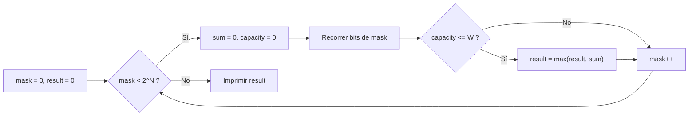

# Mochila (Knapsack)

**Autor:** KaarLarax

**Link:** Problema clásico de mochila

## Descripción

Hay $N$ objetos numerados del $1$ al $N$. El $i$-ésimo objeto tiene un peso de $w_i$ y un valor de $v_i$.

Debes elegir algunos de los $N$ objetos y llevarlos a casa en una mochila. La capacidad de la mochila es $W$, que denota el peso máximo que se puede cargar dentro de ella. En otras palabras, $W$ representa la suma total de los pesos de los objetos que se pueden llevar en la mochila.

### Problema

Imprime la suma máxima posible de valores de los objetos que puedes llevar a casa.

## Entrada

- La primera línea contiene dos números $N$ y $W$ ($1 \leq N \leq 20$, $1 \leq W \leq 100$): el número de objetos y la capacidad de la mochila.
- Las siguientes $N$ líneas contienen dos números $w_i$ y $v_i$ ($1 \leq w_i \leq 50$, $1 \leq v_i \leq 1000$): el peso y el valor del $i$-ésimo objeto.

## Salida

Imprime la suma máxima posible de valores de los objetos que puedes llevar a casa.

## Ejemplos

### Ejemplo de entrada

```text
3 8
3 30
4 50
5 60
```

### Ejemplo de salida

```text
90
```

### Ejemplo de entrada 2

```text
6 15
6 5
5 6
6 4
6 6
3 5
7 2
```

### Ejemplo de salida 2

```text
17
```

## Notas

Para el primer ejemplo, podemos elegir el objeto $1$ (peso $3$, valor $30$) y el objeto $3$ (peso $5$, valor $60$). La suma de pesos es $3 + 5 = 8 \leq 8$ (capacidad), y la suma de valores es $30 + 60 = 90$.

Para el segundo ejemplo, elegimos los objetos $2$, $4$ y $5$: pesos $5 + 6 + 3 = 14 \leq 15$ y valores $6 + 6 + 5 = 17$.

## Temas identificados

### Programación

- Iteración sobre todos los subconjuntos con bitmask
- Operadores bitwise (`<<`, `&`)
- Máximo global

### Matemáticas

- Combinatoria (subconjuntos de un conjunto finito)

## Propuesta de solución

**Autor de la propuesta:** KaarLarax

El problema de la mochila (Knapsack) es un clásico de la programación competitiva. Dado que $N \leq 20$, el número total de subconjuntos posibles es $2^{20} \approx 10^6$, lo cual es manejable con un enfoque de fuerza bruta usando bitmasks.

La idea es representar cada subconjunto como una máscara de bits de $N$ bits: el bit $j$ está encendido si el objeto $j$ pertenece al subconjunto. Iteramos sobre todas las máscaras desde $0$ hasta $2^N - 1$, y para cada una calculamos la suma de pesos y la suma de valores de los objetos seleccionados. Si la suma de pesos no excede la capacidad $W$, actualizamos la respuesta con la suma de valores.

## Observaciones

- Cada subconjunto puede representarse como un entero de $N$ bits. Con $N \leq 20$, podemos almacenar la máscara en un entero de $32$ bits sin problemas.
- El operador `mask & (1 << i)` nos permite comprobar en $O(1)$ si el objeto $i$-ésimo pertenece al subconjunto actual.
- No necesitamos memoización ni programación dinámica porque las restricciones son lo suficientemente pequeñas para el enfoque de fuerza bruta con bitmask.

## Restricciones

- $1 \leq N \leq 20$: implica $2^{20} \approx 10^6$ subconjuntos, factible con bitmask en tiempo.
- $1 \leq W \leq 100$: la capacidad es pequeña, por lo que la suma de pesos cabe fácilmente en un entero.
- $1 \leq w_i \leq 50$, $1 \leq v_i \leq 1000$: los valores y pesos máximos acumulados caben en un entero de $32$ bits ($20 \times 1000 = 20000$ para valores, $20 \times 50 = 1000$ para pesos).

## Estados o estructura de la solución

- `mask`: entero que representa el subconjunto actual (de $0$ a $2^N - 1$).
- `sum`: entero que acumula la suma de valores de los objetos seleccionados en la máscara actual.
- `capacity`: entero que acumula la suma de pesos de los objetos seleccionados en la máscara actual.
- `result`: entero que almacena el valor máximo encontrado hasta el momento.

## Casos base

- `mask = 0`: subconjunto vacío, `sum = 0`, `capacity = 0`, `result` no cambia.
- $N = 1$: solo hay $2$ subconjuntos posibles (vacío o el único objeto); se elige el objeto si $w_1 \leq W$.

## Transiciones o algoritmo

1. Leer $N$ y $W$, luego los $N$ pares $(w_i, v_i)$.
2. Inicializar `result = 0`.
3. Para cada `mask` desde $0$ hasta $2^N - 1$:
   - Inicializar `sum = 0` y `capacity = 0`.
   - Para cada bit $i$ de $0$ a $N - 1$:
     - Si `mask & (1 << i)` es distinto de $0$, agregar $v_i$ a `sum` y $w_i$ a `capacity`.
   - Si `capacity <= W`, actualizar `result = max(result, sum)`.
4. Imprimir `result`.



## Correctitud

El algoritmo explora exhaustivamente todos los $2^N$ subconjuntos posibles del conjunto de objetos. Para cada subconjunto, calcula correctamente la suma de pesos y la suma de valores usando operaciones bitwise. Si el subconjunto es válido (peso total $\leq W$), actualiza el máximo global. Al examinar todos los subconjuntos sin omisión, garantiza que se encuentra la solución óptima.

## Complejidad computacional

- Tiempo: $O(N \cdot 2^N)$, ya que para cada una de las $2^N$ máscaras recorremos los $N$ bits. Con $N = 20$, esto es $20 \times 2^{20} \approx 2 \times 10^7$ operaciones, dentro del límite de $2$ segundos.
- Memoria: $O(N)$, solo almacenamos los arreglos de pesos y valores de tamaño $N$.

## Implementación

### C++

**Autor de la implementación:** KaarLarax

```cpp
#include <bits/stdc++.h>
using namespace std;

int32_t main() {
    ios_base::sync_with_stdio(false), cin.tie(nullptr);
    int n, m, result = 0;
    cin >> n >> m;
    int values[n], weights[n];
    for (int i = 0; i < n; ++i) {
        cin >> weights[i] >> values[i];
    }
    for (int mask = 0; mask < (1 << n); ++mask) {
        int sum = 0;
        int capacity = 0;
        for (int i = 0; i < n; ++i) {
            if (mask & (1 << i)) {
                sum += values[i];
                capacity += weights[i];
            }
        }
        if (capacity <= m) {
            result = max(sum, result);
        }
    }
    cout << result << endl;
    return 0;
}
```

## Casos límite

- $N = 1$, $W = 1$, $w_1 = 50$: ningún objeto cabe en la mochila, la respuesta es $0$.
- $N = 20$, todos los $w_i = 50$ y $W = 100$: solo se pueden elegir como máximo $2$ objetos; el algoritmo evalúa todas las combinaciones y elige las $2$ de mayor valor.
- $N = 20$, $W = 100$ y todos los pesos suman $\leq 100$: se pueden llevar todos los objetos, la respuesta es la suma de todos los valores.
- $N = 20$, $W = 1$: la capacidad es mínima; solo se puede llevar un objeto si su peso es $1$, o ninguno.
