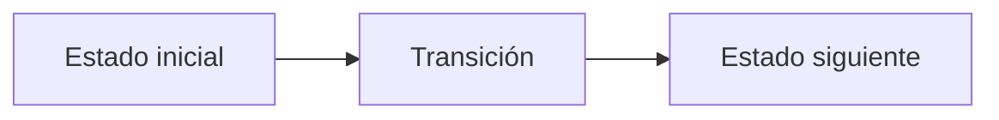

# [Letra]. [Nombre del problema]

#### Autor: [Autor del problema]

## Descripción

[Incluye aquí el enunciado del problema o un resumen fiel de lo que se debe
resolver.]

## Entrada

[Describe el formato de entrada y sus restricciones.]

## Salida

[Describe el formato de salida y, si aplica, el módulo solicitado.]

## Ejemplos

### Entrada

```text
[Ejemplo de entrada]
```

### Salida

```text
[Ejemplo de salida]
```

## Notas

[Explica los casos ilustrados, observaciones o imágenes del enunciado.]

## Temas identificados

### Programación

- [Técnica o algoritmo]

### Matemáticas

- [Concepto matemático, si aplica]

## Propuesta de solución

#### Autor: [Autor de la editorial]

Explica cómo modelar el problema y por qué la estrategia funciona.

## Observaciones

- [Observación clave del problema]

## Restricciones

[Relaciona los límites de entrada con la complejidad necesaria y justifica las
estructuras de datos elegidas.]

## Estados o estructura de la solución

[Define los estados, variables o estructuras principales. Si es programación
dinámica, explica qué representa cada estado y sus transiciones.]


## Casos base

[Indica los casos base y explica por qué son correctos.]

## Transiciones o algoritmo

[Explica paso a paso la transición entre estados o el algoritmo general.]



## Correctitud

[Argumenta por qué el algoritmo genera todas las soluciones válidas y no
cuenta ninguna solución más de una vez.]

## Complejidad computacional

- Tiempo: `O(?)`
- Memoria: `O(?)`

## Implementación

### C++

#### Autor: [Autor de la implementación]

```cpp
// Código de la solución.
```

## Casos límite

- [Caso límite y resultado esperado]
- [Caso límite relacionado con las restricciones]
